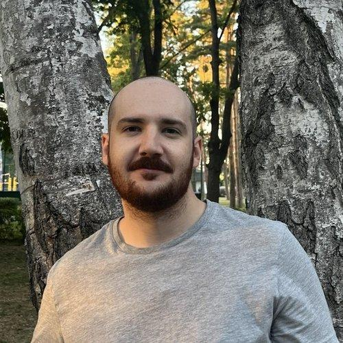

# Дмитрий Мажник



## Контактная информация

- **Email:** [dmitry-mazhnik@yandex.ru](mailto:dmitry-mazhnik@yandex.ru)
- **Telegram:** [@hokrdak](https://t.me/hokrdak)
- **Discord:** `указать Discord`
- **GitHub:** [github.com/CrabF](https://github.com/CrabF)
- **LeetCode:** [leetcode.com/u/crabf](https://leetcode.com/u/crabf/)
- **Город:** Краснодар
- **Готов к переезду:** да

---

## Обо мне

Frontend-разработчик с коммерческим опытом разработки веб-интерфейсов на React и TypeScript.

Работал с крупным корпоративным приложением объёмом около 130 000 строк кода. Занимался разработкой нового функционала, рефакторингом, тестированием, миграцией проекта с JavaScript на TypeScript и переходом с Webpack на Vite.

Имею опыт самостоятельной разработки проектов, создания UI-компонентов, Code Review и участия в архитектурных решениях.

Продолжаю развиваться во frontend-разработке, изучаю современные подходы к JavaScript и TypeScript и практикую решение алгоритмических задач.

---

## Навыки

### Frontend

- JavaScript (ES6+)
- TypeScript
- React
- React Hooks
- React Router
- Redux
- Redux Toolkit
- Next.js
- HTML
- CSS
- SCSS
- CSS Modules
- Адаптивная и кросс-браузерная вёрстка

### Тестирование

- Vitest
- Unit-тестирование
- Тестирование API
- Charles Proxy

### Инструменты

- Git
- Git Flow
- Bitbucket
- Code Review
- Vite
- Webpack
- Docker Compose
- Jenkins

### Дополнительно

- Разработка UI Kit
- Оптимизация производительности frontend-приложений
- Работа с таблицами и графиками
- Рефакторинг legacy-кода

---

## Пример кода

Решение задачи [102. Binary Tree Level Order Traversal](https://leetcode.com/problems/binary-tree-level-order-traversal/) на LeetCode:

```typescript
/**
 * Definition for a binary tree node.
 * class TreeNode {
 *     val: number
 *     left: TreeNode | null
 *     right: TreeNode | null
 *
 *     constructor(
 *         val?: number,
 *         left?: TreeNode | null,
 *         right?: TreeNode | null
 *     ) {
 *         this.val = val === undefined ? 0 : val
 *         this.left = left === undefined ? null : left
 *         this.right = right === undefined ? null : right
 *     }
 * }
 */

function levelOrder(root: TreeNode | null): number[][] {
    if (!root) return []

    const ans: number[][] = []
    const queue: TreeNode[] = [root]

    while (queue.length) {
        const lvlVals: number[] = []
        const lvlSize = queue.length

        for (let i = 0; i < lvlSize; i++) {
            const node = queue.shift()

            if (!node) continue

            lvlVals.push(node.val)

            if (node.left) {
                queue.push(node.left)
            }

            if (node.right) {
                queue.push(node.right)
            }
        }

        ans.push(lvlVals)
    }

    return ans
}
```

---

## Опыт работы

### Frontend-разработчик — Breedex

**Июнь 2025 — Май 2026**

Корпоративная система для селекционеров.

**Основные задачи:**

- разработка frontend-функциональности на React и TypeScript;
- поддержка и развитие кодовой базы объёмом около 130 000 строк;
- создание и доработка UI-компонентов;
- Code Review;
- участие в принятии архитектурных решений;
- работа по Git Flow и Pull Requests в Bitbucket.

**Достижения:**

- мигрировал около 98% исходного кода проекта с JavaScript на TypeScript;
- переписал классовые компоненты на функциональные с использованием React Hooks;
- типизировал Redux reducers;
- проводил рефакторинг и отладку сложных участков приложения;
- перевёл сборку проекта с Webpack на Vite;
- обновил ключевые зависимости и устранил использование deprecated API;
- настроил Docker Compose и работал с Jenkins.

---

### Frontend-разработчик — FedAG

**Декабрь 2024 — Март 2025**

Аутсорс-разработка веб-проектов.

**Основные задачи:**

- поддержка и развитие проектов на React и TypeScript;
- самостоятельное ведение проектов от архитектуры до деплоя;
- разработка функциональности веб-приложений;
- адаптивная и кросс-браузерная вёрстка;
- разработка UI Kit.

**Достижения:**

- разработал и перенёс крупный анимированный лендинг на Next.js;
- улучшил производительность и SEO проекта;
- разработал собственный табличный шаблон для email-писем и улучшил их отображение в различных почтовых клиентах.

---

### Ручной тестировщик — Медрокет

**Сентябрь 2022 — Май 2024**

Международная MedTech-платформа.

**Основные задачи:**

- тестирование web- и mobile-приложений;
- тестирование API и внешних интеграций;
- тестирование интеграций с VK и Google Calendar;
- наставничество младшего тестировщика.

**Достижения:**

- внедрил Charles Proxy в процесс тестирования нескольких команд;
- с нуля выстроил процесс тестирования в команде разработки;
- настраивал bug tracking и процесс взаимодействия между разработкой и тестированием.

---

## Образование

### Яндекс Практикум

**Frontend-разработчик**

2024

### Яндекс Практикум

**Инженер по тестированию**

2022

### Кубанский государственный университет

**40.05.02 Правоохранительная деятельность**

2021

### Анапский индустриальный техникум

**09.02.05 Прикладная информатика (по отраслям)**

2016

---

## Английский язык

**B1 — Intermediate**

Использую английский язык при работе с технической документацией, документацией библиотек и инструментов frontend-разработки.